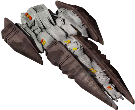

# **my endless-sky-plugins**
I aim at developing small, modular and maximally compatible plugins that don't break vanilla lore too much.  
Please excuse bad English, spelling, grammar, etc... English isn't my mother tongue. Feel free to correct me. 
<a href="https://github.com/zuckung/endless-sky-plugins/pulls">Pull requests</a>, <a href="https://github.com/zuckung/endless-sky-plugins/discussions">discussions</a> and <a href="https://github.com/zuckung/endless-sky-plugins/issues">Issue reports</a> are welcome!  
 

 

## Latest News:
<table>
<tr>
<td> 
2025-10-24 | update: disable.person.ships 
2025-10-24 | update: disable.spaceport.repeatables 
2025-10-24 | update: automata.in.human.space 
2025-10-24 | update: automata.destruction.0percent 
2025-10-24 | update: better.starts 
2025-10-23 | update: combat.ai 
2025-10-16 | update: vague.improvements 
2025-10-12 | update: ship.merging 
2025-10-11 | update: vague.improvements 
2025-10-11 | update: ship.merging 
 
</td>
</tr>
</table>

## Plugin List: 
<table>
<tr valign="top">
<td> 
<a href="README.md#automatadestruction0percent">automata.destruction.0percent</a> 
<a href="README.md#automatainhumanspace">automata.in.human.space</a> 
 </td><td> 
<a href="README.md#betterstarts">better.starts</a> 
<a href="README.md#disablepersonships">disable.person.ships</a> 
 </td><td> 
<a href="README.md#disablespaceportrepeatables">disable.spaceport.repeatables</a> 
 </td></tr></table>

## Other things
 
<ul>
  <li>If you are familiar with Python, the scripts in the <a href="tools/README.md">tools-folder</a> might be interesting. There are a few to generate some of my plugins (to keep them up-to-date). And others like an ES jpg map creator or a PR files downloader</li>
  <li>If you want to run a plugin repository like this, download <a href="https://github.com/zuckung/endless-sky-plugins/raw/refs/heads/main/tools/plugin_repo_template.zip">plugin_repo_template.zip</a>. It has detailed instructions how to setup the repository. 
  Here are some repos made from the template: 
  <a href="https://github.com/LixiChronikouOriou/ES-plugins" target="about:blank">https://github.com/LixiChronikouOriou/ES-plugins</a> 
  <a href="https://github.com/geojak/YouKnowWho-s-ES-Plugins" target="about:blank">https://github.com/geojak/YouKnowWho-s-ES-Plugins</a> 
  <a href="https://github.com/Nova1422/plugins" target="about:blank">https://github.com/Nova1422/plugins</a> 
  </li>
  <li>Furthermore, I'd like to present <a href="https://zuckung.github.io/ES-DataParser/">https://zuckung.github.io/ES-DataParser/</a> to other plugin creators or people who seek information inside the data folder. Basically it is a very fast way to view every object (root node) of the data folder on a website, especially when you don't know where to find something. For an easier browsing and comparing of game objects, like missions, ships, systems, and others. 
    </li>
  <li>I've got another new project, a github repository that lets you online generate a galaxy with up to 500 star systems and some more options to configurate that galaxy. When done, you can download it as a plugin. Here is the link. <a href="https://github.com/zuckung/ES-GalaxyGenerator">https://github.com/zuckung/ES-GalaxyGenerator</a></li>
</ul>

## Plugins

---

### automata.destruction.0percent

[automata.destruction.0percent.zip](https://github.com/zuckungtest/plugins/releases/download/v1.0.2-automata.destruction.0percent/automata.destruction.0percent.zip) | 106.67 kb | 2025-10-24 | [view files](https://github.com/zuckungtest/plugins/tree/main/myplugins/automata.destruction.0percent/) | <a href="res/imagemd/automata.destruction.0percent.md">view images</a> [2] 
1.0.2 
 
>Modifies the self destruction chance of Sestor and Mereti ships to a value of 0.0 (0%). See the README for details.

:blue_book: Plugin readme

<blockquote>### automata.destruction.0percent

 

 

Modifies the self destruction chance of Sestor and Mereti ships to a value of 0.0 (0%). 

 

Sestor 349/109/78/71/53/27/14 and Mereti 512/256/128/64/32/16/8 ships have a self destruction value of 0.0 (0%) now. 

You can easily change the values in automata.txt for each ship ('"self destruct" .0') to a value of your choice. I.e. 0.12 is 23%, 0.3 is 51%, 0.5 is 75%. Its calculated twice, first the chance for self destruction on boarding(i.e. 0.3) is 30%, then of the remaining 70% again 30% chance for self destruction on capturing. That makes 30% + 21% = 51% overall chance for self destruction on a capturing try. 

 

 

Changelog: 

 

2025-08-29 

typo fixes by snoggles 

license, README, icon@2x, plugintxt changes 

 

2024-06-07 

text corrections (thx to TheGiraffe3) 

 

2023-10-17 

added plugin.txt 

 

2023-09-07 

changed icon 

changed about.txt 

changed readme 

</blockquote>

 

---

### automata.in.human.space

[automata.in.human.space.zip](https://github.com/zuckungtest/plugins/releases/download/v1.0.3-automata.in.human.space/automata.in.human.space.zip) | 96.62 kb | 2025-10-24 | [view files](https://github.com/zuckungtest/plugins/tree/main/myplugins/automata.in.human.space/) | <a href="res/imagemd/automata.in.human.space.md">view images</a> [2] 
1.0.3 
 
>Brings jump drive equipped automata into human space after the wanderer campaign. See the README for details.

:blue_book: Plugin readme

<blockquote>### automata.in.human.space

 

 

Brings jump drive equipped automata into human space after the wanderer campaign.  

 

You can find them where Korath ships in human space are usually found(ember waste and eastern syndicate).  

The chance to encounter previous Korath ships or automata is like 50/50.  

 

 

Changelog: 

 

2025-08-29 

license, README, icon@2x, plugintxt changes 

 

2024-09-24 

removed jumpdrive from fighters and drones and put them correctly into the carriers 

adjusted some fleet variants 

 

2023-10-17 

added plugin.txt 

 

2023-09-01 

added more fleet variants  

reworked readme  

changed icon.png 

</blockquote>

 

---

### better.starts

[better.starts.zip](https://github.com/zuckungtest/plugins/releases/download/v1.0.6-better.starts/better.starts.zip) | 804.25 kb | 2025-10-24 | [view files](https://github.com/zuckungtest/plugins/tree/main/myplugins/better.starts/) | <a href="res/imagemd/better.starts.md">view images</a> [6] 
1.0.6 
 
>Adds several new start options with different ships, background stories, credits and debts. See the README for details.

:blue_book: Plugin readme

<blockquote>### better.starts  

 

Adds several new start options with different ships, background stories, credits and debts. 

 

<ul>

<li>Start: Trader | Freighter: equipped for cargo transport, in Merak system</li>

<li>Start: Trader (Hai) | Aphid: equipped for cargo transport, in Fah Soom system(Hai space)</li>

<li>Start: Passenger Transport | Scout: equipped for passenger transport, Talita system</li>

<li>Start: Miner | Sunder: equipped for mining, in Rasalhague system</li>

<li>Start: Salvager | Shuttle: equipped for boarding, in Aldhibain system</li>

<li>Start: Salvager(big) | Argosy: equipped for boarding, in Aldhibain system</li>

<li>Start: Explorer to Remnant | Heavy Shuttle: equipped for exploring the Remnant, in Tania Australis system</li>

<li>Start: Explorer to Automata | Bounder: equipped for exploring the Kor Automata, in Mirfak system</li>

<li>Start: Cheater | Squiddy + 20xSquiddyDrone: 10b credits, full visible human space, Jump Drive, in Sol system, no story</li>

</ul>

 

Beside the cheater start options, all others are balanced and lore friendly. A bigger ship means a bigger bank loan. All starts come with 200.000 credits cash and a bank loan between 600.000 and 4,5 million credits. The ships outfits are changed to fit the role. The intro missions on New Boston are set as completed. Same goes for the Hai start with the Hai first contact mission. 

 

 

Changelog: 

 

2025-06-18 

removed cheater start2 

changed cheater start with new ship sprites 

 

2025-05-19 

typo fixes by snoogles 

icon@2x, plugintxt changes 

 

2024-11-02  

changed cheater 2 start heron to have 20 heavy warship bays 

 

2024-10-08  

proofreading and minor text changes (Vemenous-Repentile) 

added a new cheater start with Quarg outfits, ships and more credits 

 

2024-06-07 

text corrections (thx to TheGiraffe3) 

 

2024-03-15 

Start: Cheater, changed Heron weapons and added 10x KIV with beam weapons 

Start: Cheater, added mission for full visible human space to the outfitter 

 

2024-02-15 

Start: Cheater... fixed map not showing all systems 

Start: Miner... changed ship to "Sunder" with 2 Mining Drones 

 

2023-10-17 

added plugin.txt 

 

2023-09-15 

added passenger transport start 

set intro missions to done for all starts 

doubled bank loan duration / halfed interest rate for all starts 

changed cheater start ship and credits 

 

2023-09-03 

changed miner start to a system with outfitter 

added Start Trader Freighter 

added Start Trader (Hai) Aphid 

added Start Explorer to Remnant 

added Start Explorer to Automata 

</blockquote>

 
screenshots(click to enlarge): 
<table>
	<tr>
		<td></td>
	</tr>
</table>
 

 

---

### disable.person.ships

[disable.person.ships.zip](https://github.com/zuckungtest/plugins/releases/download/v1.0.1-disable.person.ships/disable.person.ships.zip) | 107.71 kb | 2025-10-24 | [view files](https://github.com/zuckungtest/plugins/tree/main/myplugins/disable.person.ships/) | <a href="res/imagemd/disable.person.ships.md">view images</a> [2] 
1.0.1 
 
>Disables all person ships. See the README for details.

:blue_book: Plugin readme

<blockquote>### disable.person.ships  

 

 

Disables all 14 random spawning person ships. 

 

<ul>

<li>	"Michael Zahniser" </li>

<li>	"Cap'n Pester" </li>

<li>	"Marauding Max" </li>

<li>	"Captain Nate" </li>

<li>	"Tranquility" </li>

<li>	"Power of the People" </li>

<li>	"Local God" </li>

<li>	"Subsidurial" </li>

<li>	"Prototype B3-CC4" </li>

<li>	"Rais Iris XVIII" </li>

<li>	"Zitchas" </li>

<li>	"Brick" </li>

<li>	"Gefullte Taubenbrust" </li>

<li>	"MasterOfGrey" </li>

<li>	"Patrol Team" </li>

</ul>

 

 

Changelog: 

 

2025-08-29 

license, README, icon@2x, plugintxt changes 

 

2024-02-02 

added 0.10.5 "Patrol Team" 

 

2023-10-17 

added plugin.txt 

 

2013-08-31 

added icon.png 
</blockquote>

 

---

### disable.spaceport.repeatables

[disable.spaceport.repeatables.zip](https://github.com/zuckungtest/plugins/releases/download/v1.1.2-disable.spaceport.repeatables/disable.spaceport.repeatables.zip) | 108.22 kb | 2025-10-24 | [view files](https://github.com/zuckungtest/plugins/tree/main/myplugins/disable.spaceport.repeatables/) | <a href="res/imagemd/disable.spaceport.repeatables.md">view images</a> [2] 
1.1.2 
 
>Disables all repeatable spaceport missions. I.e. shady passenger transport, drug smuggling, time critical transport or defend planet. See the README for details.

:blue_book: Plugin readme

<blockquote>### disable.spaceport.repeatables

 

 

Disables all spaceport repeatable missions. These missions annoy me. Removes the 8 dialog repeatables, the 8 defend planet missions and the 4 republic catastrophe repeatables. 

 

 

<ul>

<li> "Shady passenger transport 1" </li>

<li> "Shady passenger transport 2" </li>

<li> "Shady passenger transport 3" </li>

<li> "Drug Running 1" </li>

<li> "Drug Running 2" </li>

<li> "Drug Running 3" </li>

<li> "Courier 1" </li>

<li> "Courier 2" </li>

<li> "Southern Pirate Attack" </li>

<li> "Northern Pirate Attack" </li>

<li> "Core Pirate Attack" </li>

<li> "Pirate Occupation [0]" </li>

<li> "Pirate Occupation [1]" </li>

<li> "Pirate Occupation [2]" </li>

<li> "Raider Attack 1" </li>

<li> "Raider Attack 2" </li>

<li> "Republic Navy Advisory System [frozen]" </li>

<li> "Republic Navy Advisory System [volcanic]" </li>

<li> "Republic Navy Advisory System [wildfire cargo]" </li>

<li> "Republic Navy Advisory System [wildfire firefighters]" </li>

<li> "Small Scale Delivery" (Kor Efret)<li>

</ul>

 

 

Changelog: 

 

2025-08-29 

license, README, icon@2x, plugintxt changes 

 

2024-05-26 

added "Small Scale Delivery" from Kor Efret 

 

2024-04-06 

added the 4 republic catastrophe repeatables 

 

2023-10-17 

added plugin.txt 

 

2023-09-03 

added the 2 syndicate alien attack missions 

 

2023-08-31 

added the 3 pirate occupation missions 

added icon.png 
</blockquote>

 
